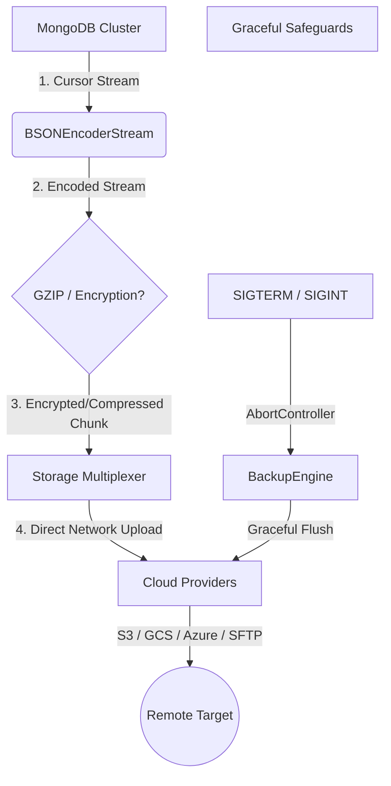

# MongoShield Masterclass: A Deep Engineering Learning Guide 🎓

Welcome to the **MongoShield** project! If you are new to this codebase, you have entered a treasure trove of modern Node.js engineering, systems architecture, secure cryptography, and resilient network design. 

This guide is systematically structured to teach you **every concept, package, theory, practice, and developer trick** embedded in this production-grade repository. Use this as your reference map to learn deep, production-level JavaScript and TypeScript systems engineering.

---

## 🗺️ Visual Architecture Overview
Here is how the components inside MongoShield interact under the hood:



---

## 1. Core Concepts & Theoretical Computer Science

### A. Zero-Dependency Streaming Architecture (Constant Memory Complexity)
*   **The Problem:** Typical backup tools act as wrappers around `mongodump` and `mongorestore` binaries. This forces you to write files to disk first, taking up disk space, violating security boundaries, and failing in serverless environments (like AWS Lambda or Vercel) where local filesystems are read-only or strictly limited.
*   **The Theory:** **$O(1)$ Space Complexity**. No matter if the database is 50MB or 500GB, MongoShield's memory consumption remains constant (typically < 100MB). 
*   **The Implementation:** Data is read using MongoDB cursor streams, transformed on-the-fly, and piped directly to remote cloud storage. Disk is never touched.

### B. High-Throughput Backpressure & Stream Flow Control
*   **The Theory:** If a fast database cursor reads records faster than a slow remote SFTP server can accept them, the data accumulates in Node's memory, eventually crashing the process with an `Out of Memory (OOM)` error. 
*   **The Concept:** **Backpressure**. Node.js streams implement a highWaterMark buffer. When a writable stream's buffer fills up, it signals the readable stream to pause reading until it is ready for more.
*   **The Practice:** All transformations and pipeline flows in MongoShield use Node's native stream pipelines, preserving backpressure chains perfectly.

### C. Cryptographic Envelope Encryption (AES-256-GCM)
*   **The Theory:** Traditional backup encryption encrypts the file *after* it has been saved to disk. Envelope streaming encryption encrypts data *chunks* as they move through the pipeline.
*   **The Practice:** We use `crypto.createCipheriv` with **AES-256-GCM** (Galois/Counter Mode). GCM provides **Authenticated Encryption with Associated Data (AEAD)**. It guarantees both confidentiality (nobody can read it) and integrity (nobody can tamper with a single byte of your backup without triggering an decryption error).

### D. Atomic File Writing & Safe Renaming
*   **The Theory:** If a process crashes while writing a JSON state or audit file, the file becomes partially written and corrupt.
*   **The Concept:** **Atomicity**. An operation is either 100% successful or doesn't happen at all.
*   **The Practice:** The `AuditLogger` writes to a temporary unique file (e.g. `audit.json.tmp.uuid`) and then calls `fs.rename`. The operating system guarantees that a rename operation is atomic at the filesystem level.

---

## 2. Advanced Developer Tricks & Hacks

### A. SFTP Recursive `mkdirp` Helper
*   **The Hack:** The SFTP protocol has no native equivalent to `mkdir -p` (creating nested parent directories). Calling `mkdir` on a path like `/a/b/c` fails if `/a` or `/b` don't exist.
*   **The Solution:** We implement a recursive loop that splits the target path into segments, checks if each directory exists using `stat()`, catches "ENOENT" errors to safely invoke `mkdir()`, and moves down the directory chain asynchronously.

### B. Mocking Classes & Constructor Invocations in Vitest
*   **The Hack:** When writing mock classes in testing frameworks, arrow functions (`() => {}`) do not possess a `[[Construct]]` internal method in V8. If your production code calls `new MyMockClass()`, Vitest will throw `TypeError: ... is not a constructor`.
*   **The Solution:** Always define your mock implementations using standard JavaScript functions (`function() {}`) or direct ES6 classes so they can be instantiated with `new`:
    ```typescript
    vi.mocked(BackupEngine).mockImplementation(function() {
      return { run: mockRun } as any;
    } as any);
    ```

### C. Direct S3/GCS Streaming Without Content-Length
*   **The Hack:** Standard cloud storage APIs expect to know the exact file size (`Content-Length`) before uploading. Since MongoShield streams live cursors, we cannot know the backup size beforehand.
*   **The Solution:** We leverage multipart/resumable upload streams. For AWS S3, we use `@aws-sdk/lib-storage`'s `Upload` utility, which automatically buffers incoming streams into chunks and commits them concurrently. For Azure, we utilize `BlockBlobClient.uploadStream`.

---

## 3. High-Quality Engineering Practices

### A. Monorepo Workspaces & Package Isolation
*   **The Concept:** High modularity. Users using MongoShield on AWS S3 should not have to install dependencies for Azure Blob Storage or SFTP (like `@azure/storage-blob` or `ssh2`).
*   **The Practice:** Managed via **PNPM Workspaces** (`pnpm-workspace.yaml`). The main `@mongoshield/core` contains the streaming engine, while cloud adapters live in independent ecosystem packages (`@mongoshield/provider-s3`, `@mongoshield/provider-network`, etc.).

### B. Graceful Shutdown & The Grace Period Strategy
*   **The Concept:** Databases should never be left in a half-backed-up state when servers scale down or restart.
*   **The Practice:** In `BackupScheduler`, when a `SIGTERM` or `SIGINT` is intercepted, we do not kill the process immediately. We initiate a **grace period timer (e.g. 30s)**. The active stream finishes flushes of its current batch. If the timer expires before completion, the `AbortController` triggers a safe, graceful termination of stream operations.

### C. Preflight Connection Validation Pattern
*   **The Practice:** Fail fast. We never start pulling data from MongoDB if we cannot write to the target storage. Every provider must implement an `_initialize` hook that tests storage write permissions (e.g., verifying bucket existence, credentials, or creating remote root paths) before a single collection cursor is loaded.

---

## 4. Full Technology & Package Breakdown

| Package / Technology | Role in MongoShield | Deep Concept You Can Learn |
|---|---|---|
| **Node.js Streams** | Native core engine (`Readable`, `Writable`, `Transform`, `PassThrough`, `pipeline`). | Learn how data streams chunk-by-chunk through CPU/network pipelines without filling RAM. |
| **MongoDB Cursor Streams** | Extracting database documents incrementally. | Learn how to stream massive DB collections without loading whole query arrays into memory. |
| **`croner`** | Scheduler scheduling daemon. | Learn how standard cron expressions are calculated, scheduled, and triggered in the V8 event loop. |
| **`ssh2`** | Low-level SSH client wrapper for the SFTP provider. | Learn how raw TCP packets are negotiated, authenticated via SSH keys, and used to execute file protocols. |
| **`pino`** | High-performance JSON logger. | Learn how logs are structured in JSON format for consumption by Datadog, ELK, or AWS CloudWatch. |
| **`zod`** | Configuration schemas and runtime validations. | Learn how to achieve end-to-end type safety at runtime, converting untrusted inputs into verified schemas. |
| **`vitest`** | Monorepo test runner. | Learn how to perform advanced module mocking, fake timers, and mock standard system/network behaviors. |
| **`tsup`** & **`esbuild`** | Bundle compilation (compiles ES6, CommonJS, and TS definitions). | Learn how monorepo builds are orchestrated, maintaining cross-compatibility between CJS and ESM environments. |

---

<br/>
